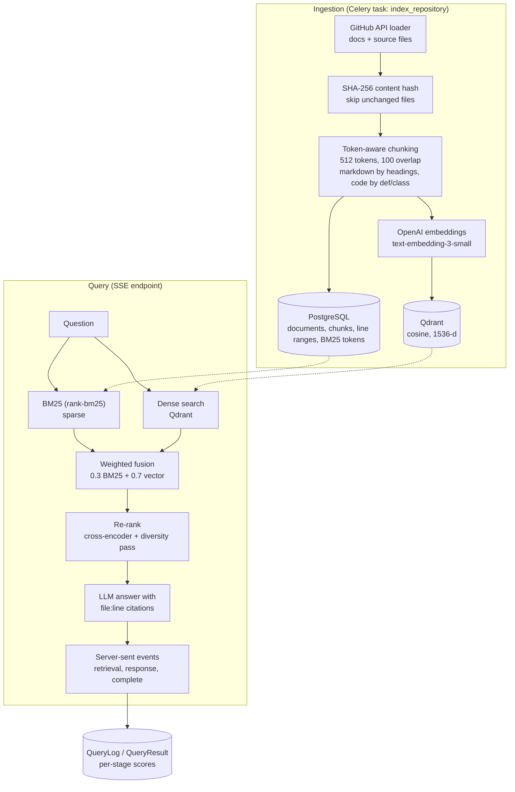

# VaulS.ai

A hybrid-retrieval RAG service for GitHub repositories. Point it at a repo and it indexes the files into Postgres and Qdrant; ask a question and it retrieves with both keyword (BM25) and dense-vector search, re-ranks the candidates, and streams back an LLM answer that cites the file and line range of every source it used.

## The problem

Pure vector search misses exact identifiers, error strings and config keys; pure keyword search misses paraphrases. Code and docs need both, plus an answer the reader can verify. VaulS.ai combines the two retrievers, re-ranks the merged candidates, and keeps source attribution (file path, line range) attached to every chunk from ingestion through to the response.

## Architecture



### Pipeline

- **Ingestion.** `POST /api/repositories/index/` queues a Celery task that reads a repository through the GitHub API (documentation, source and config files up to 1 MB; hidden paths, `node_modules`, build output skipped), de-duplicates documents by SHA-256, and splits them with a token-aware chunker (`tiktoken`, 512 tokens with 100 overlap). Markdown is split at headings and code fences, code at `def`/`class` boundaries. Each chunk is stored with its line range, BM25 tokens, and an embedding point in Qdrant.
- **Retrieval.** BM25 (`rank-bm25`, Okapi) and dense search each return a candidate set; scores are max-normalised and merged with configurable weights (default 0.3 sparse, 0.7 dense). The merged list is re-ranked with a cross-encoder (`ms-marco-MiniLM-L-6-v2`) and a Jaccard-based diversity pass that penalises near-duplicate chunks.
- **Generation.** Retrieved chunks are passed to the LLM with `[SOURCE: path (lines a-b)]` tags and an instruction to cite them or say it cannot answer. The response streams as server-sent events: `retrieval` events (chunk, scores), `response` tokens, then `complete`.
- **Observability.** Every query is logged with the per-chunk retrieval scores of what it returned; `/api/query/compare/` shows the stage scores for a query and `/api/analytics/queries/` aggregates the log.
- **Index maintenance.** A Celery beat job rebuilds the BM25 index daily.

## API

| Method | Path | Purpose |
|---|---|---|
| POST | `/api/repositories/index/` | Queue indexing of `{owner, name, branch}` (`202`) |
| POST | `/api/repositories/rebuild_index/` | Rebuild the BM25 index |
| GET | `/api/repositories/stats/` | Repository, document and chunk counts |
| GET | `/api/query/stream/?q=&top_k=` | Streamed answer (SSE) |
| GET | `/api/query/citations/?q=&citation_format=` | Retrieval with citations as json, markdown, html or bibtex |
| GET | `/api/query/explain/`, `/api/query/compare/` | Per-stage scoring for a query |
| GET | `/api/analytics/queries/` | Query log analytics |
| GET | `/api/health/` | Health check |

`/api/documents/` and `/api/chunks/` expose the stored data.

## Stack

Django 4.2 and Django REST Framework, Celery with Redis, PostgreSQL, Qdrant, `rank-bm25`, `sentence-transformers`, `tiktoken`, PyGithub, OpenAI embeddings and chat models. Everything is configured through environment variables (`.env.example`): chunk size and overlap, fusion weights, re-rank and final top-k, embedding and LLM model.

## Run it

```bash
cp .env.example .env                           # OPENAI_API_KEY, optional GITHUB_TOKEN
docker compose up -d                           # postgres, redis, qdrant, web, Celery worker and beat
docker compose exec web python manage.py migrate

curl -X POST localhost:8000/api/repositories/index/ \
  -H 'Content-Type: application/json' -d '{"owner":"vercel","name":"next.js","branch":"main"}'
curl "localhost:8000/api/query/stream/?q=how%20does%20routing%20work&top_k=5"
```

## Status

This is a prototype of the full pipeline: the ingestion, retrieval, citation and logging modules and the API surface are written, and the tests cover the chunker, the BM25 index, the models and the health and repository endpoints. The end-to-end path has not been run, and reading the code turns up problems that need fixing before the stack will start:

- `requirements.txt` pins `qdrant-client==2.7.0`, which is not a published version, so the image does not build until the pin is corrected.
- `retrieval/reranker.py` imports `CrossEncoderModel`; `sentence-transformers` exposes `CrossEncoder`.
- The streaming view calls `client.messages.stream(...)` on the OpenAI client; the OpenAI SDK streams through `chat.completions.create(..., stream=True)`.
- The initial migration sits in `rag_api/migrations`, which is not an installed app, so `migrate` does not create the models in `rag_api.core`.
- `docker-compose.yml` runs Celery beat with `django_celery_beat`, which is neither installed nor in `INSTALLED_APPS`.
- `HybridRetriever` dereferences the BM25 index before one has been built.

There are no retrieval-quality or latency measurements in the repository, so none are claimed here.
